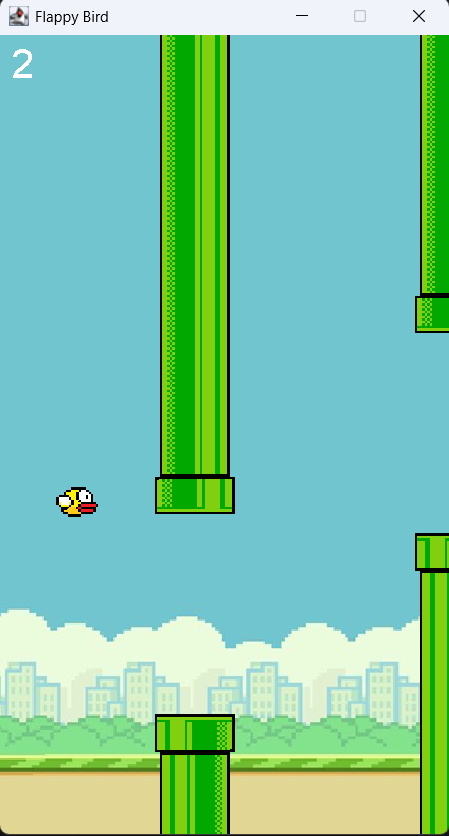

# Flappy Bird Game 🐦🎮

## Setup Instructions 🛠️

### Requirements:
- Java 8 or higher ☕
- IDE like IntelliJ IDEA or Eclipse 💻

### Steps:
1. Clone the repository:
   ```bash
   git clone https://github.com/cidopenup/Flappy-Bird-Game.git
   ```
   
2. Navigate to the project directory:
   ```bash
   cd Flappy-Bird-Game
   ```

3. Open the project in your preferred IDE 🖥️.

4. Run `App.java` as a Java application ▶️.

5. Play the game! 🎮

### Controls:
- Spacebar: Make the bird jump 🕹️.

---

### Game Preview 🎮


Enjoy the game! 😊
